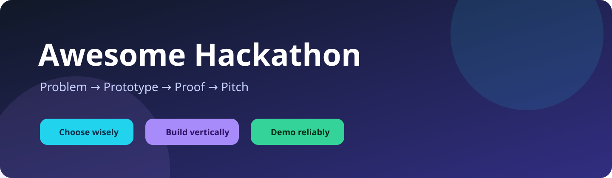

# Awesome Hackathon [](https://awesome.re)
<!--lint disable double-link awesome-list-item-->

> A curated, maintained, and execution-focused repository for discovering hackathons, selecting a feasible problem, building a reliable project, organizing an event, and delivering a credible demo.

[](https://github.com/sihab-hasan/awesome-hackathon/actions/workflows/ci.yml)
[](https://github.com/sihab-hasan/awesome-hackathon/actions/workflows/link-check.yml)
[](LICENSE)
[](catalog/resources.json)
[](catalog/schema.json)
[](https://sihab-hasan.github.io/awesome-hackathon/)



## Contents

- [Start Here](#start-here)
- [Curated Resources](#curated-resources)
- [Resource Packs](#resource-packs)
- [Participant Handbook](#participant-handbook)
- [Playbooks](#playbooks)
- [Blueprints](#blueprints)
- [Project Ideas](#project-ideas)
- [Organizer and Judge Operations](#organizer-and-judge-operations)
- [Repository Quality](#repository-quality)
- [Maintainer Operations](#maintainer-operations)

## Start Here

| Goal                      | Recommended route                                                                                                                          |
| ------------------------- | ------------------------------------------------------------------------------------------------------------------------------------------ |
| Attend a first hackathon  | [Quick start](docs/getting-started/quickstart.md) → [First-project guide](handbook/getting-started/first-project.md) → [24-hour playbook](playbooks/24-hour.md) |
| Find a defensible problem | [Idea discovery](handbook/getting-started/finding-an-idea.md) → [Project briefs](project-ideas/README.md)                                  |
| Choose a stack            | [Stack selector](docs/getting-started/stack-selector.md) → [Architecture blueprints](blueprints/architectures/)                                                 |
| Build an AI project       | [AI track](tracks/ai.md) → [AI resources](resources/ai/) → [AI safety checklist](checklists/ai-safety.md)                                  |
| Stabilize a demo          | [Demo rescue](playbooks/demo-rescue.md) → [Demo-day checklist](checklists/demo-day.md)                                                     |
| Organize an event         | [Organizer operations manual](organizers/README.md) → [Judging system](organizers/judging.md)                                              |
| Evaluate projects         | [Judge handbook](judges/README.md) → [Rubric](judges/rubric.md)                                                                            |


**Public documentation:** [Browse the complete web documentation](https://sihab-hasan.github.io/awesome-hackathon/) — every repository Markdown document is published with a link back to its canonical GitHub source.

The operating model is:

```text
Problem evidence → smallest useful workflow → working vertical slice
→ reliability and safety pass → demo narrative → submission evidence
```

<!-- catalog:start -->
<!--lint enable awesome-list-item-->

## Curated Resources

The canonical catalog currently contains **197** reviewed resources across **41** categories. Each category page is generated from the machine-readable catalog.

### Accessibility

[Browse all 3 resources](resources/accessibility/).

- [axe-core](https://github.com/dequelabs/axe-core) - Automated accessibility checks.
- [Lighthouse](https://developer.chrome.com/handbook/lighthouse/overview) - Fast web quality checks.
- [WAI Web Accessibility Tutorials](https://www.w3.org/WAI/tutorials/) - Accessible web implementation.

### Ai

[Browse all 12 resources](resources/ai/).

- [Anthropic Claude Platform Docs](https://docs.anthropic.com/) - Reasoning and tool-using applications.
- [DeepEval](https://deepeval.com/handbook/) - Automated AI quality checks.
- [Google AI for Developers](https://ai.google.dev/) - Multimodal prototypes.

### Analytics

[Browse all 3 resources](resources/analytics/).

- [Grafana](https://grafana.com/handbook/grafana/latest/) - Operational dashboards.
- [Plausible Analytics](https://plausible.io/docs) - Simple website analytics.
- [PostHog](https://posthog.com/docs) - Understanding product usage.

### Apis

[Browse all 4 resources](resources/apis/).

- [JSONPlaceholder](https://jsonplaceholder.typicode.com/) - Frontend prototypes.
- [Mockaroo](https://www.mockaroo.com/) - Demo datasets.
- [Public APIs](https://github.com/public-apis/public-apis) - Finding data and service APIs.

### Authentication

[Browse all 4 resources](resources/authentication/).

- [Auth0](https://auth0.com/docs) - Standards-based authentication.
- [Better Auth](https://www.better-auth.com/docs) - Self-managed TypeScript authentication.
- [Clerk](https://clerk.com/docs) - Fast polished authentication.

### Automation

[Browse all 2 resources](resources/automation/).

- [n8n](https://docs.n8n.io/) - Integration-heavy prototypes.
- [Pipedream](https://pipedream.com/docs) - Fast API workflows.

### Backend

[Browse all 10 resources](resources/backend/).

- [Bruno](https://docs.usebruno.com/) - Collaborative API testing.
- [Bun](https://bun.sh/docs) - Fast JavaScript tooling.
- [Django](https://docs.djangoproject.com/) - Data-heavy web applications.

### Cloud

[Browse all 4 resources](resources/cloud/).

- [AWS](https://docs.aws.amazon.com/) - Broad infrastructure needs.
- [GitHub Codespaces](https://docs.github.com/en/codespaces) - Consistent team setup.
- [Google Cloud](https://cloud.google.com/docs) - Cloud and AI prototypes.

### Collaboration

[Browse all 6 resources](resources/collaboration/).

- [Discord](https://support.discord.com/) - Hackathon communities and teams.
- [GitHub Projects](https://docs.github.com/en/issues/planning-and-tracking-with-projects) - Repository-centered task tracking.
- [Linear](https://linear.app/docs) - Focused software execution.

### Communications

[Browse all 3 resources](resources/communications/).

- [Novu](https://docs.novu.co/) - Multi-channel notification workflows.
- [OneSignal](https://documentation.onesignal.com/) - Cross-platform notifications.
- [Twilio Messaging](https://www.twilio.com/handbook/messaging) - Messaging prototypes.

### Data Visualization

[Browse all 3 resources](resources/data-visualization/).

- [Apache ECharts](https://echarts.apache.org/en/option.html) - Dashboards and complex charts.
- [D3.js](https://d3js.org/getting-started) - Custom interactive charts.
- [Plotly](https://plotly.com/javascript/) - Scientific and analytical charts.

### Databases

[Browse all 9 resources](resources/databases/).

- [Cloudflare D1](https://developers.cloudflare.com/d1/) - Cloudflare-native applications.
- [Firebase](https://firebase.google.com/docs) - Mobile and realtime apps.
- [MongoDB Atlas](https://www.mongodb.com/handbook/atlas/) - Flexible data models.

### Datasets

[Browse all 4 resources](resources/datasets/).

- [Data.gov](https://data.gov/) - Civic and public-data projects.
- [Kaggle Datasets](https://www.kaggle.com/datasets) - Data science prototypes.
- [WHO Data](https://data.who.int/) - Health and public-policy projects.

### Design

[Browse all 4 resources](resources/design/).

- [Canva](https://www.canva.com/) - Pitch decks and visual assets.
- [Excalidraw](https://docs.excalidraw.com/) - Fast architecture diagrams.
- [Figma](https://help.figma.com/) - UI design and clickable prototypes.

### Developer Tools

[Browse all 6 resources](resources/developer-tools/).

- [Cloudflare Tunnel](https://developers.cloudflare.com/cloudflare-one/connections/connect-networks/) - Sharing local services.
- [DevToys](https://devtoys.app/) - Common transformations.
- [Git](https://git-scm.com/doc) - Team collaboration.

### Devops

[Browse all 2 resources](resources/devops/).

- [Docker](https://docs.docker.com/) - Reproducible environments.
- [GitHub Actions](https://docs.github.com/en/actions) - Project automation.

### Documentation

[Browse all 4 resources](resources/documentation/).

- [Docusaurus](https://docusaurus.io/docs) - Feature-rich project documentation and public handbooks.
- [MkDocs](https://www.mkdocs.org/) - Simple documentation sites built from Markdown.
- [Storybook](https://storybook.js.org/docs) - Documenting and reviewing reusable interface components.

### Email

[Browse all 4 resources](resources/email/).

- [Mailgun](https://documentation.mailgun.com/docs/mailgun/) - Email routing, validation, and API-driven delivery.
- [Postmark](https://postmarkapp.com/developer/) - Delivery-focused transactional email prototypes.
- [Resend](https://resend.com/docs/introduction) - Sending transactional email from modern web applications.

### Frontend

[Browse all 12 resources](resources/frontend/).

- [Angular](https://angular.dev/) - Structured team projects.
- [Astro](https://docs.astro.build/) - Landing pages and documentation.
- [daisyUI](https://daisyui.com/) - Very fast prototypes.

### Games

[Browse all 3 resources](resources/games/).

- [Godot Engine](https://docs.godotengine.org/en/stable/) - Cross-platform game prototypes.
- [Phaser](https://docs.phaser.io/) - Web game prototypes.
- [Unity Documentation](https://docs.unity3d.com/) - 3D, AR, and game prototypes.

### Hackathons

[Browse all 10 resources](resources/hackathons/).

- [Devpost](https://devpost.com/hackathons) - Finding and submitting to hackathons.
- [DoraHacks](https://dorahacks.io/hackathon) - Blockchain and open-source events.
- [ETHGlobal](https://ethglobal.com/events) - Ethereum builders.

### Hardware

[Browse all 6 resources](resources/hardware/).

- [Adafruit Learning System](https://learn.adafruit.com/) - Hardware learning and examples.
- [Arduino Documentation](https://docs.arduino.cc/) - Microcontroller prototypes.
- [Edge Impulse](https://docs.edgeimpulse.com/) - TinyML prototypes.

### Hosting

[Browse all 7 resources](resources/hosting/).

- [Cloudflare Pages](https://developers.cloudflare.com/pages/) - Global edge applications.
- [Fly.io](https://fly.io/handbook/) - Containerized services.
- [GitHub Pages](https://docs.github.com/en/pages) - Project sites and documentation.

### Inspiration

[Browse all 4 resources](resources/inspiration/).

- [App Ideas Collection](https://github.com/florinpop17/app-ideas) - Choosing a buildable idea.
- [Awesome](https://github.com/sindresorhus/awesome) - Finding specialized resources.
- [Build Your Own X](https://github.com/codecrafters-io/build-your-own-x) - Deep technical project inspiration.

### Learning

[Browse all 9 resources](resources/learning/).

- [CS50](https://cs50.harvard.edu/x/) - Core computer science fundamentals.
- [freeCodeCamp](https://www.freecodecamp.org/learn/) - Structured learning and refreshers.
- [Full Stack Open](https://fullstackopen.com/en/) - Modern full-stack foundations.

### Maps

[Browse all 5 resources](resources/maps/).

- [Google Maps Platform](https://developers.google.com/maps/documentation) - Location and places applications.
- [Leaflet](https://leafletjs.com/reference.html) - Simple interactive maps.
- [Mapbox Developers](https://www.mapbox.com/developers) - Polished geospatial products.

### Media

[Browse all 1 resources](resources/media/).

- [Mux](https://www.mux.com/docs) - Video products.

### Messaging

[Browse all 4 resources](resources/messaging/).

- [Apache Kafka](https://kafka.apache.org/documentation/) - High-throughput event streaming when the team already knows Kafka.
- [CloudAMQP](https://www.cloudamqp.com/docs/) - Hosted RabbitMQ queues with operational dashboards.
- [NATS](https://docs.nats.io/) - Fast messaging and event-driven system prototypes.

### Mobile

[Browse all 5 resources](resources/mobile/).

- [Android Developers](https://developer.android.com/) - Native Android and Kotlin applications.
- [Expo](https://docs.expo.dev/) - Rapid React Native mobile prototypes.
- [Flutter](https://docs.flutter.dev/) - Single-codebase mobile, web, and desktop applications.

### Observability

[Browse all 4 resources](resources/observability/).

- [Better Stack](https://betterstack.com/docs/) - Simple uptime checks, logs, and demo-day incident visibility.
- [Grafana Cloud](https://grafana.com/docs/grafana-cloud/) - Fast hosted dashboards and multi-signal monitoring.
- [OpenTelemetry](https://opentelemetry.io/docs/) - Portable observability instrumentation and telemetry pipelines.

### Open Source

[Browse all 3 resources](resources/open-source/).

- [First Contributions](https://github.com/firstcontributions/first-contributions) - Learning pull requests.
- [Good First Issue](https://goodfirstissue.dev/) - Finding approachable contributions.
- [Up For Grabs](https://up-for-grabs.net/) - Open-source project discovery.

### Payments

[Browse all 2 resources](resources/payments/).

- [Paddle Developer Docs](https://developer.paddle.com/) - SaaS billing prototypes.
- [Stripe Documentation](https://docs.stripe.com/) - Payment and subscription prototypes.

### Presentation

[Browse all 3 resources](resources/presentation/).

- [Google Slides](https://workspace.google.com/products/slides/) - Team pitch decks.
- [Loom](https://www.loom.com/) - Asynchronous demo videos.
- [OBS Studio](https://obsproject.com/) - Backup demo recordings.

### Productivity

[Browse all 2 resources](resources/productivity/).

- [Obsidian](https://help.obsidian.md/) - Research and project notes.
- [Raycast](https://manual.raycast.com/) - Fast developer workflows.

### Realtime

[Browse all 4 resources](resources/realtime/).

- [Ably](https://ably.com/docs/) - Reliable hosted realtime features with minimal infrastructure work.
- [Pusher](https://pusher.com/docs/) - Quick hosted realtime channels and notifications.
- [Socket.IO](https://socket.io/docs/v4/) - Realtime prototypes controlled by a JavaScript team.

### Search

[Browse all 3 resources](resources/search/).

- [Algolia](https://www.algolia.com/doc/) - Fast polished search.
- [Meilisearch](https://www.meilisearch.com/docs) - Self-hosted application search.
- [Typesense](https://typesense.org/handbook/) - Instant search experiences.

### Security

[Browse all 6 resources](resources/security/).

- [GitHub CodeQL](https://codeql.github.com/handbook/) - Automated security scanning.
- [Gitleaks](https://gitleaks.io/) - Preventing credential leaks.
- [Mozilla Observatory](https://developer.mozilla.org/en-US/observatory) - Public deployment checks.

### Storage

[Browse all 4 resources](resources/storage/).

- [Amazon S3](https://docs.aws.amazon.com/s3/) - Cloud-native object storage and event-driven file workflows.
- [Cloudinary](https://cloudinary.com/documentation) - Image and video workflows.
- [Supabase Storage](https://supabase.com/docs/guides/storage) - File storage in applications already using Supabase.

### Testing

[Browse all 5 resources](resources/testing/).

- [Cypress](https://docs.cypress.io/) - Interactive browser tests.
- [k6](https://grafana.com/handbook/k6/latest/) - API load tests.
- [Playwright](https://playwright.dev/handbook/intro) - Critical user-flow tests.

### Ui Ux

[Browse all 5 resources](resources/ui-ux/).

- [Google Fonts](https://fonts.google.com/) - Typography.
- [Heroicons](https://heroicons.com/) - Tailwind-oriented interfaces.
- [LottieFiles](https://lottiefiles.com/) - UI animation.

### Vector Databases

[Browse all 3 resources](resources/vector-databases/).

- [Pinecone](https://docs.pinecone.io/) - Managed vector retrieval.
- [Qdrant](https://qdrant.tech/documentation/) - Vector search and RAG.
- [Weaviate](https://docs.weaviate.io/) - Semantic and hybrid retrieval.

<!--lint disable awesome-list-item-->
<!-- catalog:end -->

## Resource Packs

Task-oriented packs reduce search time without hiding the complete catalog:

- [First Hackathon](resources/packs/first-hackathon.md)
- [Web Application](resources/packs/web-app.md)
- [AI Application](resources/packs/ai-app.md)
- [Mobile Application](resources/packs/mobile-app.md)
- [Hardware and IoT](resources/packs/hardware-iot.md)
- [Demo Day](resources/packs/demo-day.md)
- [Organizer](resources/packs/organizer.md)
- [Privacy First](resources/packs/privacy-first.md)

Use the [offline catalog CLI](catalog/CLI.md) to filter by category, audience, lifecycle stage, platform, source type, tag, or risk level.

## Participant Handbook

The [handbook](handbook/README.md) covers the full lifecycle: event selection, team roles, problem framing, product scope, engineering, AI safety, security, privacy, accessibility, testing, deployment, pitching, submission, and post-event continuation.

## Playbooks

- [24-hour event](playbooks/24-hour.md)
- [48-hour event](playbooks/48-hour.md)
- [72-hour event](playbooks/72-hour.md)
- [Demo rescue](playbooks/demo-rescue.md)
- [External API outage](playbooks/api-outage.md)
- [Security incident](playbooks/security-incident.md)
- [Deployment rollback](playbooks/deployment-rollback.md)
- [Team recovery](playbooks/team-recovery.md)

## Blueprints

The [blueprint library](blueprints/README.md) contains architecture decisions, product specifications, implementation patterns, and reference-build plans. They are end-state decision documents—not unreviewed starter-code dumps.

## Project Ideas

The [project-idea library](project-ideas/README.md) contains problem-first briefs with target users, evidence requirements, a narrow demonstration slice, risks, evaluation criteria, and extension paths.

## Organizer and Judge Operations

- [Organizer operations manual](organizers/README.md)
- [Timeline and readiness gates](organizers/timeline.md)
- [Mentor program](organizers/mentors.md)
- [Safety and conduct response](organizers/safety.md)
- [Submission operations](organizers/submissions.md)
- [Judge handbook](judges/README.md)
- [Scoring rubric](judges/rubric.md)

## Repository Quality

The catalog is the single source of truth. Generated views are checked for drift. The repository enforces schema validation, internal-link integrity, freshness, Markdown quality, spelling, external-link monitoring, CodeQL, dependency review, release checksums, and documentation builds.

Read the [Quality Standard](docs/maintainers/quality-standard.md), [Curation Policy](docs/maintainers/curation.md), [Resource Lifecycle](docs/maintainers/resource-lifecycle.md), and [Validation Report](docs/repository/validation.md).

## Maintainer Operations

- [Repository architecture](docs/repository/architecture.md)
- [Maintainer playbook](docs/maintainers/playbook.md)
- [Editorial checklist](docs/maintainers/editorial-checklist.md)
- [Curation policy](docs/maintainers/curation.md)
- [Resource lifecycle](docs/maintainers/resource-lifecycle.md)
- [Maintenance policy](docs/maintainers/maintenance.md)
- [GitHub push guide](docs/maintainers/github-push.md)
- [Release procedure](docs/maintainers/releasing.md)

## Contributing

Read [CONTRIBUTING.md](CONTRIBUTING.md) before opening a pull request. Resource proposals must use an official or primary source when available, state a concrete hackathon use case, avoid promotional wording, disclose affiliations, and satisfy the review checklist.
